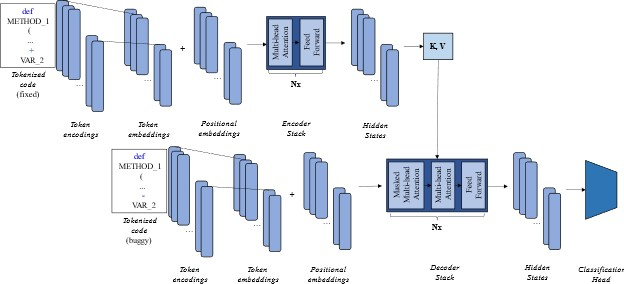

# Generating Python Mutants from Bug Fixes using Neural Machine Translation

This repository contains the code for the paper _"Generating Python Mutants from Bug Fixes using Neural Machine Translation"_ by *[Sergen AŞIK](https://seng.ogu.edu.tr/Personel/Detay/6/arsgor-sergen-asik)*, and *[Uğur YAYAN](https://seng.ogu.edu.tr/Personel/Detay/5/drogruyesi-ugur-yayan)*.


## Dataset

Dataset folder contains the Python scripts that are used to create the dataset. The dataset is created using the following steps:

- _commit_to_diff.py (Extraction)_ script is used to downloads the diff files of the commits in the commit list file and saves them to the diffTexts folder. The commit list file contains the commit ids of the commits and repository urls of the repositories. The commit list file is in the following format:

```
commit_id1,repository_url1
commit_id2,repository_url2
...
commit_idn,repository_urln
```

- _diff_to_tp.py (Transform)_ script is used to separate text files with the commit differences one by one. It then calls the sep_file function to get the buggy and fixed version of each file. While performing this operation, each buggy and fixed source code pair must be numbered the same. Global variables are needed in order for the numbering process to be regular.

- _edit_actions.py (Classifier)_ script is used to extract the actions that occur during the conversion of the buggy code to the fixed code. Actions of source codes translated to ASTs are obtained with xml_diff. The actions are saved in the mutation_types folder.

- _abstraction.py (Abstraction)_ script is used to abstract source code to reduce vocabulary size.

- _ex_abs_main.py_ script is the main script for the create dataset process. It calls the other scripts in the correct order.

<p align="center">
  
</p>

### Requirements

Python 3.8 or above is required. You can install the requirements using the following command:

```bash
pip install -r Dataset/requirements.txt
```

### Usage

To start the dataset creation process, you must first create a commit list file. The commit list file contains the commit ids of the commits and repository urls of the repositories. The commit list file is in the following format:

```bash
python Dataset/main.py
```

## Transformer Model

The Transformer is a neural network architecture that solves sequence to sequence problems using attention mechanisms. The Transformer model is used to translate the fixed source code to the buggy source code. The Transformer model is implemented using the [PyTorch](https://pytorch.org/) library. The Transformer model is trained using the [dataset](https://drive.google.com/drive/folders/1tWKtiZuHg1r1ffuLrCemLQm0Qi_3QIX8?usp=drive_link) created in the previous step. The architecture of the Transformer model is shown in the following figure:

<p align="center">
  
</p>


### Requirements

Python 3.8 or above is required. You can install the requirements using the following command:

```bash
pip install -r Model/requirements.txt
```

### Training

Let's see how we can train the Transformer Model from scratch using the code in this repo. First let's download the [dataset](https://drive.google.com/drive/folders/1tWKtiZuHg1r1ffuLrCemLQm0Qi_3QIX8?usp=drive_link). The dataset folder contains the following subfolders:
- _Update_: contains the update mutation type source and target files
- _Delete_: contains the delete mutation type source and target files
- _Insert_: contains the insert mutation type source and target files

The files are seperated two parts: Formatted and Unformatted. Formatted files are the files that are formatted using the special tokens like NEWLINE, INDENT and DEDENT. Unformatted files are the files that are not formatted using the special tokens. We used the formatted files in our experiments.

Then train our model:

```bash
python Model/main.py
```

## License

MIT